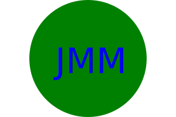

# SVG Logo Maker

## 🌟 Challenge Overview
This SVG Logo maker is designed to help create a logo for anyone who uses it. It focuses on generating a three character logo with a choice of shapes.

## 📝 Description 
This git bash function and repo is meant to be used for those who want to generate a three character logo with shapes either, Square, Circle, or Triangle. Once entering in node index.js within your personal git bash and cloning code you will see promted questions appear once fully answered your logo will save into your logo.svg file.

##  User Story
As a person who runs a professional business I would like to create a logo that can help my project appear more professional with a generated three character logo. 

## ✨ Key Features
- **Git-Bash**: Using your personal terminal you will use git bash to clone my github code so that you may be able to use the logo maker.
- **User-Friendly Interface**: Designed for ease of use with intuitive navigation and interactive elements. Along side with notations for what the code run can do. 
- **SVG-Logo-Maker**: You will also need to download the SVG logo maker extention within your VS code.


## 🔗 Useful Links
- **Repository**: [GitHub](https://github.com/AngelShex/Challenge-10-OOP)
- **Live Application**: [OOP-Challenge](https://angelshex.github.io/Challenge-10-OOP/)

## Usage

1. Open the cloned repository in any source code editor e.g. Visual Studio Code.

2. Open integrated terminal on index.js

3. Enter “node index.js” in the command line

4. Through sequential order within the command line interface - the user will be presented with npm inquirer questions - the user will provide a response to each question and proceed.

5. Once completed a SVG file named "logo.svg" will be created.

6. At your discretion, you may rename the "logo.svg" file to the file name of your choice.

7. (Optional) Regarding future use, you may alter the prompted questions within the index.js to best suit your needs.

8. (Optional) The SVG Logo Maker serves as a foundation so you are not limited to altering the files (as you have my permission) to create the best possible "logo.svg" file.


### 🛠️ Installation and Setup
1. Clone the repository to your local machine.
2. Install necessary dependencies (if any).
3. Run the application locally.


### Clone

```bash
   git clone git@github.com:AngelShex/Challenge-10-OOP.git
```

### Basic Steps:

1. Clone the SSH key from my git hub account.
2. Download all of the nessicary dependencies.
3. Type node index.js within your personal git bash or VS code.

## Technologies Used
- JavaScript
- Jest
- jQuery
- SVG LOGO Maker
- JASON


## 📚 External Resources


- Shapes pictures in example section: [Example 1 Image](!examples/example1triangle.svg)[Example 2 Image]( [Example 3 Image](examples/example3square.svg)

- [YouTubeLink](https://www.youtube.com/watch?v=emFMHH2Bfvo) (https://www.youtube.com/watch?v=GJYMcLus3v0&t=18s) SVG information.


## License
This project is licensed under the [MIT License](LICENSE). See the LICENSE file for more details.

## Contributing
Contributions to this SVG Logo Maker are welcome. Please follow the standard fork-pull request workflow. Ensure you include detailed descriptions in your pull requests.

## Support
For support, queries, or suggestions, please open an issue in the repository or contact the project maintainers.

---

*This README was last updated on March 7, 2024 @ 7:33pm.*